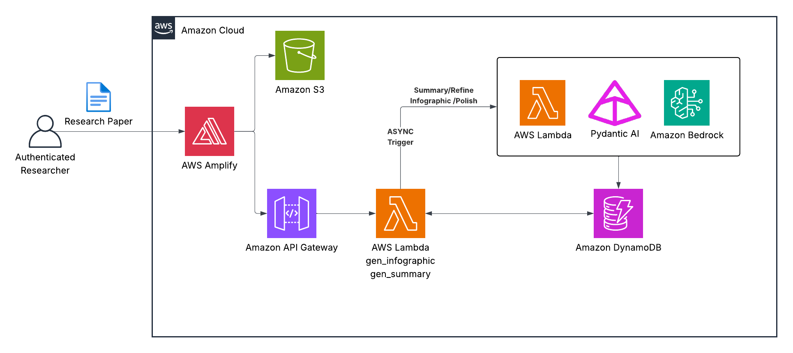

# CommonGround

| Index                         | Description                                         |
|:------------------------------|:----------------------------------------------------|
| [Overview](#overview)         | See what this project does and its key capabilities |
| [Demo](#demo)                 | View the demo video                                 |
| [Description](#description)   | Learn about the problem and our approach            |
| [Architecture](#architecture) | View the system architecture diagram                |
| [Tech Stack](#tech-stack)     | Technologies and services used                      |
| [Deployment](#deployment)     | How to install and deploy the solution              |
| [Usage](#usage)               | How to use the application                          |
| [Costs](#costs)               | Estimated AWS costs for running the solution        |
| [Credits](#credits)           | Meet the team behind this project                   |
| [License](#license)           | See the project's license information               |
| [Disclaimers](#disclaimers)   | Important legal disclaimers                         |

---

# Overview

**CommonGround** is a serverless AI-powered platform that transforms academic research papers into accessible content for any audience. The solution leverages large language models (LLMs) through AWS services to generate audience-tailored summaries, social media posts, press releases, and visual infographics from uploaded PDFs.

**Key capabilities include:**

- **Multiple Output Formats**: Generate summaries, press releases, blog posts, LinkedIn posts, X posts, or visual infographics from a single research paper.
- **Audience Targeting**: Tailor content for general public, clinicians, academic researchers, or define a custom audience with specific demographics and interests.
- **Iterative Refinements**: Refine outputs with natural language prompts to adjust tone, length, or content. Manually edit both generated text and individual infographic fields before sharing.
- **Usage Tracking**: Monitor resource consumption and costs for each generation and refinement to keep usage transparent to users.
- **Citation Verification**: Every statistic in the generated output is backed by a verbatim quote from the source paper. Automatic verification flags any claims that could not be matched back to the original text.

---

# Demo

<video src="media/demo.mp4" controls width="100%"></video>

---

# Description

## Problem Statement

Academic research papers are written for expert audiences, making them inaccessible to the general public, policymakers, and even clinicians outside the specific field. Communications teams at research institutions spend hours manually rewriting findings for press releases, social media, and public-facing process that doesn't scale. Without accessible translations, critical research on public health, climate, and policy fails to reach the audiences who need it most, limiting the real-world impact of scientific discoveries.

## Our Approach

CommonGround addresses these challenges through an intelligent document transformation platform that combines audience-aware AI generation with iterative refinement capabilities. The solution automates the translation of complex research into accessible content while giving users fine-grained control over tone, format, and target audience.

**Summarization and Refinement:** Uploaded PDFs are stored in S3 and processed by a summarize Lambda powered by Claude Sonnet 4.6 via Amazon Bedrock. The AI follows audience-specific prompts, jargon-free analogies for the general public, practical takeaways for clinicians, methodology focus for researchers, and supports custom audiences (e.g., "high school schools") with dynamically generated prompts. Output format prompts shape the same content into summaries, press releases, blog posts, LinkedIn posts, or X/Twitter content. CommonGround maintains conversation history in DynamoDB so users can refine outputs with natural language instructions without regenerating from scratch, and can manually edit the generated text to keep a human in the loop before sharing.

**Infographic Generation:** Users can generate a visual infographic from the paper, with five SVG template layouts available to choose from. Pydantic AI's structured output extracts the relevant content into fixed slots, which are rendered into an SVG. Users can edit individual fields or apply AI polish with a natural language prompt.   

**Citation Verification:**  Every statistic is backed by a verbatim quote from the source paper and automatically verified against the extracted text. Unverified claims are flagged so users can review AI accuracy before publishing.   

**Serverless Event-Driven Architecture:** A lightweight trigger Lambda returns a job ID immediately and invokes the compute-heavy summarize Lambda asynchronously, avoiding API Gateway's 29 second timeout. The frontend polls a job status endpoint until completion, keeping response times fast regardless of how long Bedrock takes.    

---

# Architecture



---

# Tech Stack

| Category                      | Technology                                                | Purpose                                                                           |
|:------------------------------|:----------------------------------------------------------|:----------------------------------------------------------------------------------|
| **Amazon Web Services (AWS)** | [AWS CDK](https://docs.aws.amazon.com/cdk/)               | Infrastructure as code for deployment and resource provisioning                   |
|                               | [Amazon Bedrock](https://aws.amazon.com/bedrock/)         | Invoked Claude Sonnet 4.6 for summaries, refinements, and infographic generations |
|                               | [Amazon S3](https://aws.amazon.com/s3/)                   | Stores uploaded PDFs and generated outputs                                        |
|                               | [AWS Lambda](https://aws.amazon.com/lambda/)              | Summarize, refine, upload, and API endpoints                                      |
|                               | [Amazon DynamoDB](https://aws.amazon.com/dynamodb/)       | Stores summary output, refinement history, and cost tracking                      |
|                               | [Amazon API Gateway](https://aws.amazon.com/api-gateway/) | REST API endpoint to call backend lambdas                                         |
|                               | [Amazon Cognito](https://aws.amazon.com/cognito/)         | User authentication and authorization                                             |
|                               | [AWS Amplify](https://aws.amazon.com/amplify/)            | Hosts the frontend site                                                           |
| **Backend**                   | [Pydantic AI](https://ai.pydantic.dev/)                   | Agent orchestration and structured output validation around Bedrock               |
|                               | [Python 3.12](https://www.python.org/)                    | Lambda runtime language                                                           |
|                               | [boto3](https://aws.amazon.com/sdk-for-python/)           | AWS SDK                                                                           |
|                               | [PyMuPDF](https://pymupdf.readthedocs.io/)                | PDF text extraction and chunking                                                  |
| **Frontend**                  | [React](https://react.dev/)                               | UI framework for building the web interface                                       |
|                               | [Vite](https://vite.dev/)                                 | Frontend build and dev server                                                     |
|                               | [TypeScript](https://www.typescriptlang.org/)            | Type-safe frontend development                                                    |
|                               | [Tailwind CSS](https://tailwindcss.com/)                  | Utility-first CSS framework for styling components                                |


---

# Deployment

## Prerequisites

Before deploying CommonGround, ensure you have the following prerequisites in place:
1. Sign up for an [AWS account](https://signin.aws.amazon.com/signup?request_type=register) if you haven't already.
2. **Node.js** (v20 or later) — [Download here](https://nodejs.org/en/download) or use [nvm](https://github.com/nvm-sh/nvm)
3. **AWS CDK** (v2) - install via `npm`:
   ```bash
   npm install -g aws-cdk
   ```
4. **AWS CLI** — [Installation Guide](https://docs.aws.amazon.com/cli/latest/userguide/getting-started-install.html)
5. **Docker** (running) — [Download here](https://www.docker.com/get-started/). Required by CDK to bundle Python Lambda functions.
6. **zip** and **curl** — standard system utilities
   - macOS: `brew install zip`
   - Linux: `sudo apt install zip`
   - Windows (Git Bash): `choco install zip` via [Chocolatey](https://chocolatey.org)
7. **Git** — [Download here](https://git-scm.com/). Windows users should run all scripts in **Git Bash** (included with Git for Windows) rather than Command Prompt or PowerShell.

AWS CDK is installed automatically as a local project dependency — no global install needed.

## AWS Configuration

Configure your credentials before running any deploy script:

```bash
aws configure
# or, for SSO:
aws sso login --profile <your-profile>
```

CDK bootstrap (one-time per AWS account/region) is run automatically by `deploy.sh` on first deploy. To skip it on subsequent runs pass `--skip-bootstrap`.

## Quick Start — Full Deploy

The root-level `deploy.sh` script handles everything in order: prerequisites check, AWS identity confirmation, infrastructure (CDK), then frontend (Amplify).

```bash
git clone https://github.com/pitt-cic/CommonGround.git
cd CommonGround

# Make scripts executable (Mac/Linux/Git Bash on Windows)
chmod +x deploy.sh infra/deploy-infra.sh frontend/deploy-frontend.sh frontend/setup-dev.sh

# First-time production deploy (prompts for confirmation)
./deploy.sh

# Dev deploy with a named profile
./deploy.sh --dev alice --stage dev --profile myprofile

# Production deploy, no prompts (e.g. CI)
./deploy.sh --stage prod --profile myprofile --yes
```

What the script does:

- Verifies Node.js, npm, Docker, AWS CLI, zip, and curl are present
- Warns and confirms if defaulting to a production target
- Displays and confirms the active AWS identity (once, shared across both phases)
- Deploys CDK infrastructure — DynamoDB, Lambda, API Gateway, Cognito, S3, and an Amplify App
- Builds the React frontend and deploys it to Amplify via zip upload
- Prints the live application URL on completion

### deploy.sh options

| Flag | Default | Description |
|:-----|:-------:|:------------|
| `--dev NAME` | — | Developer name (required for non-prod stacks) |
| `--stage STAGE` | `prod` | Deployment stage: `dev`, `beta`, or `prod` |
| `--profile NAME` | default | AWS CLI profile |
| `--branch NAME` | `main` | Amplify branch name for frontend deployment |
| `--skip-bootstrap` | off | Skip CDK bootstrap (use after first deploy) |
| `--require-approval LEVEL` | `broadening` | CDK approval level: `never`, `any-change`, `broadening` |
| `--skip-build` | off | Skip frontend build, deploy existing `dist/` |
| `--no-wait` | off | Don't poll for Amplify deployment completion |
| `--infra-only` | off | Deploy infrastructure only, skip frontend |
| `--frontend-only` | off | Deploy frontend only (infra must already exist) |
| `--yes` / `-y` | off | Skip all confirmation prompts |

If neither `--dev` nor `--stage` is provided, the script defaults to a production deployment and requires explicit confirmation.

## Manual Deployment (individual scripts)

### Infrastructure

```bash
cd infra
./deploy-infra.sh --stage prod --profile myprofile --yes
# or for dev:
./deploy-infra.sh --dev alice --stage dev --profile myprofile
```

Options mirror `deploy.sh`: `--dev`, `--stage`, `--profile`, `--skip-bootstrap`, `--require-approval`, `--yes`.

### Frontend

The frontend script reads CloudFormation outputs to generate the `.env.production` file automatically, then builds and uploads to Amplify.

```bash
cd frontend
./deploy-frontend.sh --stage prod --profile myprofile --yes
# or for dev:
./deploy-frontend.sh --dev alice --stage dev --profile myprofile
```

Additional frontend-only options: `--branch NAME`, `--skip-build`, `--no-wait`.

## Local Development

1. **Ensure the infrastructure stack has been deployed**, then run the setup script from the `frontend` directory:
   ```bash
   cd frontend
   ./setup-dev.sh --stage prod
   # or for a dev stack:
   ./setup-dev.sh --stage dev --dev alice
   ```
   This fetches CloudFormation outputs and writes them to `.env`, then installs npm dependencies.

2. **Start the development server**:
   ```bash
   npm run dev
   ```

---

# Usage

1. **Accessing the application**:

   Once deployed, access the web interface using the Amplify URL. Run the deploy script (./deploy.sh) to view your application URL and other deployment details.

2. **User Registration**:

   CommonGround uses admin-only user creation - self-signup is disabled. Register new users in the Amazon Cognito User Pool via the AWS Management Console. [Learn more about creating user accounts in Cognito](https://docs.aws.amazon.com/cognito/latest/developerguide/how-to-create-user-accounts.html).

3. **Login**:

   Log in using the credentials of the account created in the previous step. You will be prompted to change your password on first login.

4. **Generating Your Custom Output**:

   - **Upload**: Drag and drop or select a research paper PDF.
   - **Customize**: Choose your target audience (general public, clinicians, academic researchers, or a custom audience you define) and your output format (summary, press release, blog post, LinkedIn post, or X/Twitter post). Optionally select an infographic template.
   - **Generate**: Review your selections and click "Generate". The summarization runs asynchronously — the page will poll for completion automatically.

5. **Reviewing and Refining**:

   - After generation, review the output alongside **citation references** — each statistic is backed by a verbatim quote from the source paper, with a verified/unverified indicator so you can check AI accuracy.
   - Use the refinement input to adjust the output with natural language instructions (e.g., "make it shorter", "emphasize the public health implications").
   - Manually edit the text directly before finalizing.
   - If an infographic was generated, open the infographic panel to view it, edit individual fields, or apply AI polish with a natural language prompt.

6. **Sharing the Result**:

   - **LinkedIn**: Opens LinkedIn with a prompt to paste your final draft into a new post.
   - **X/Twitter**: Opens X with your content pre-filled in the post composer.
   - **Press Release**: No share link — copy the draft and add your media contact details before distributing.
   - **Summary / Blog Post**: Copy the final draft to your clipboard.

---

# Costs

## Estimated Monthly Recurring Costs

The following table shows baseline AWS infrastructure costs at low to no usage. The primary variable cost is Amazon Bedrock usage.

| Service              | Estimated Cost   | Notes                                                   |
|:---------------------|:----------------:|:--------------------------------------------------------|
| AWS Lambda           | ~$0              | Free tier: 1M requests + 400,000 GB-seconds/month       |
| Amazon API Gateway   | ~$0              | $3.50/million API calls; negligible at low usage         |
| Amazon S3            | ~$0              | $0.023/GB; PDF uploads and SVGs cost under $0.01         |
| Amazon DynamoDB      | ~$0              | Pay-per-request; free tier covers typical low usage      |
| Amazon Cognito       | ~$0              | Free up to 10,000 monthly active users                   |
| AWS Amplify          | ~$10–20          | Hosting and build minutes beyond the free tier           |
| **Total Baseline**   | **~$10–20/month**| Excluding Amazon Bedrock usage                           |

## Per-Action Bedrock Costs

CommonGround uses **Claude Sonnet 4.6** via Amazon Bedrock cross-region inference. Effective pricing (including the 10% cross-region multiplier) is **$3.30 per 1M input tokens** and **$16.50 per 1M output tokens**.

| Action               | Approx. Input Tokens | Approx. Output Tokens | Approx. Cost |
|:---------------------|:--------------------:|:---------------------:|:------------:|
| Generate output      |            ~20,000   |               ~1,500  |  ~$0.09–0.11 |
| Refine output        |            ~18,000   |               ~1,200  |  ~$0.08–0.10 |
| Generate infographic |            ~15,000   |                 ~500  |  ~$0.06–0.08 |
| Polish infographic   |            ~10,000   |                 ~400  |  ~$0.04–0.05 |

**Example monthly scenario** — 4 papers, 10 refinements per paper, 5 infographics:

| Line item              | Quantity | Unit Cost | Subtotal |
|:-----------------------|---------:|:---------:|:--------:|
| Generate output        |        4 |    ~$0.10 |   ~$0.40 |
| Refine output          |       40 |    ~$0.09 |   ~$3.60 |
| Generate infographic   |        5 |    ~$0.07 |   ~$0.35 |
| Polish infographic     |        5 |    ~$0.05 |   ~$0.25 |
| **Bedrock total**      |          |           | **~$4.60** |
| AWS infrastructure     |          |           | ~$10–20  |
| **Monthly total**      |          |           | **~$15–25** |

> **Note:** Cost estimates are based on AWS pricing as of August 2026. Token counts vary by paper length and output type. Actual costs may differ.


---

# Credits

**CommonGround** is an open-source project developed by the University of Pittsburgh Health Sciences and Sports Analytics Cloud Innovation Center.

**Development Team:**

- [Vincent Zhu](https://www.linkedin.com/in/vincent-zhu1689/)
- [Tanishq Bansod](https://www.linkedin.com/in/tanishq-bansod/)

**Project Leadership:**

- **Technical Lead**: [Maciej Zukowski](https://www.linkedin.com/in/maciejzukowski/) - Solutions Architect, Amazon Web Services (AWS)
- **Program Manager**: [Kate Ulreich](https://www.linkedin.com/in/kate-ulreich-0a8902134/) - Program Leader, University of Pittsburgh Health Sciences and Sports Analytics Cloud Innovation Center
- **Program Manager**: [Dwight Helfrich](https://www.linkedin.com/in/dwight-helfrich-53a233b/) - Program Leader, University of Pittsburgh Health Sciences and Sports Analytics Cloud Innovation Center

**Special Thanks**:

- [Kathleen McTigue](https://people.dom.pitt.edu/people/kathleen-m-mctigue-md-ms-mph) — Professor of Medicine, Epidemiology, and Clinical & Translational Science with Tenure, Vice Chair for Real-World Evidence, Department of Medicine
- [Megan Hamm](https://people.dom.pitt.edu/people/megan-e-hamm-phd) — Associate Professor of Medicine, Director of Qualitative Services, Associate Director for Qualitative Analysis, Center for Biostatistics and Qualitative Methodology (CBQM)

This project is designed and developed with guidance and support from the [Health Sciences and Sports Analytics Cloud Innovation Center](https://digital.pitt.edu/cic), powered by AWS.

---

# License

This project is licensed under the [MIT License](./LICENSE).

```plaintext
MIT License

Copyright (c) 2026 University of Pittsburgh Health Sciences and Sports Analytics Cloud Innovation Center

Permission is hereby granted, free of charge, to any person obtaining a copy
of this software and associated documentation files (the "Software"), to deal
in the Software without restriction, including without limitation the rights
to use, copy, modify, merge, publish, distribute, sublicense, and/or sell
copies of the Software, and to permit persons to whom the Software is
furnished to do so, subject to the following conditions:

The above copyright notice and this permission notice shall be included in all
copies or substantial portions of the Software.

THE SOFTWARE IS PROVIDED "AS IS", WITHOUT WARRANTY OF ANY KIND, EXPRESS OR
IMPLIED, INCLUDING BUT NOT LIMITED TO THE WARRANTIES OF MERCHANTABILITY,
FITNESS FOR A PARTICULAR PURPOSE AND NONINFRINGEMENT. IN NO EVENT SHALL THE
AUTHORS OR COPYRIGHT HOLDERS BE LIABLE FOR ANY CLAIM, DAMAGES OR OTHER
LIABILITY, WHETHER IN AN ACTION OF CONTRACT, TORT OR OTHERWISE, ARISING FROM,
OUT OF OR IN CONNECTION WITH THE SOFTWARE OR THE USE OR OTHER DEALINGS IN THE
SOFTWARE.
```

---

For questions, issues, or contributions, please visit our [GitHub repository](https://github.com/[org]/[repo]) or
contact the development team.

---

# Disclaimers

**Customers are responsible for making their own independent assessment of the information in this document.**

**This document:**  
(a) is for informational purposes only,  
(b) references AWS product offerings and practices, which are subject to change without notice,  
(c) does not create any commitments or assurances from AWS and its affiliates, suppliers or licensors. AWS products or
services are provided "as is" without warranties, representations, or conditions of any kind, whether express or
implied. The responsibilities and liabilities of AWS to its customers are controlled by AWS agreements, and this
document is not part of, nor does it modify, any agreement between AWS and its customers, and  
(d) is not to be considered a recommendation or viewpoint of AWS.

**Additionally, you are solely responsible for testing, security and optimizing all code and assets on GitHub repo, and
all such code and assets should be considered:**  
(a) as-is and without warranties or representations of any kind,  
(b) not suitable for production environments, or on production or other critical data, and  
(c) to include shortcuts in order to support rapid prototyping such as, but not limited to, relaxed authentication and
authorization and a lack of strict adherence to security best practices.

**All work produced is open source. More information can be found in the GitHub repo.**
